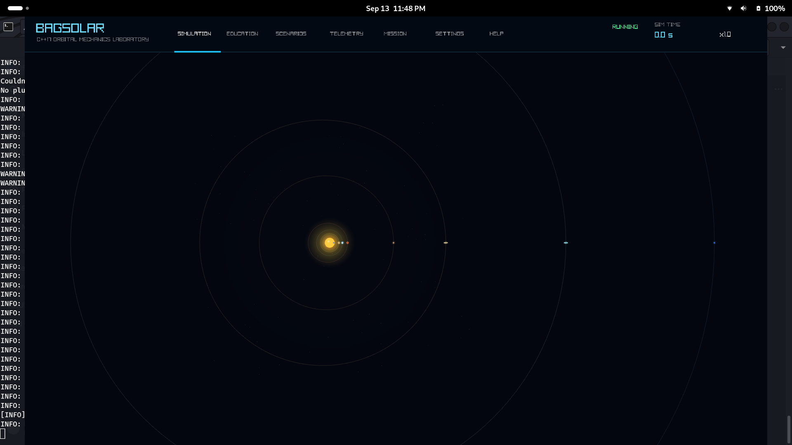
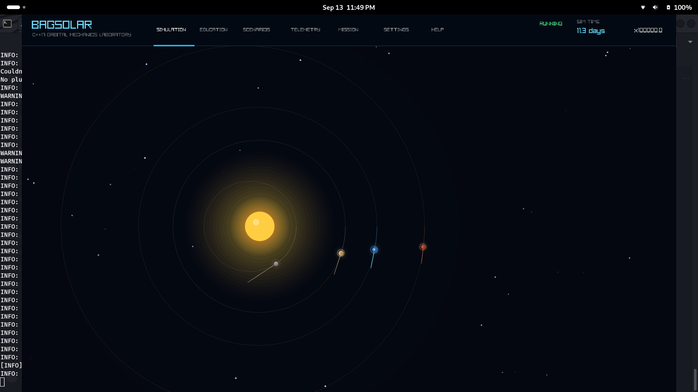

# BAGSOLAR

BAGSOLAR is an interactive C++17 orbital-mechanics laboratory and scientific-
computing portfolio project. It combines a raylib visualization with a
raylib-free Newtonian simulator, explicit SI units, numerical integration,
scientific telemetry, validation, ephemeris/reference-provider boundaries, and
a guided education system.

The project is technically interesting because it makes scientific contracts
visible: epochs, coordinate origins, frame orientation, units, integrators,
timesteps, provider provenance, numerical failure states, and prediction/reference
comparisons are represented explicitly rather than hidden in the UI.

The current implementation provides:

- Newtonian N-body gravity with Euler, semi-implicit Euler, Velocity Verlet, and RK4.
- Orbital elements, energy, angular momentum, conservation diagnostics, adaptive
  timestep handling, close-approach reporting, and collision reporting.
- Deterministic analytical validation for circular and elliptical orbits,
  hyperbolic classification, Hohmann transfers, conservation, and timestep
  convergence.
- Telemetry sessions with orbital quantities, numerical status, CSV/JSON export,
  metadata, and compatibility checks.
- Local deterministic, JSON, optional JPL Horizons, and optional CSPICE ephemeris
  provider boundaries.
- Nine lessons, guided experiments, scored challenges, progress persistence,
  learner reports, recommendations, and Prediction vs Reference education.

BAGSOLAR is a Newtonian educational/scientific simulator. It is not a
high-fidelity production astrodynamics propagator. Prediction vs Reference
compares BAGSOLAR's numerical prediction with an explicit reference ephemeris;
it is not a claim that either result is observational truth. Finite burns
currently use mass-flow accounting and apply the resulting velocity change as
an impulse. Gravity-assist support is patched-conic turn-angle analysis.
Mission Tools provide an analytical/API foundation for spacecraft, maneuver,
Hohmann, gravity-assist, and trajectory calculations; they are not a complete
mission editor.

## Visual overview

The application presents the solar-system simulation through a focused raylib
interface with live simulation controls, orbital paths, trails, and telemetry:





Project author: [Adam Boateng on LinkedIn](https://www.linkedin.com/in/adamsboateng/)

| Capability | Current evidence | Default availability |
| --- | --- | --- |
| Numerical physics | Raylib-free Newtonian core with four integrators and adaptive timestep support | Offline |
| Scientific validation | Analytical orbit, conservation, Hohmann, and timestep-convergence checks | Offline |
| Telemetry | Orbital state, energy, angular momentum, numerical status, CSV/JSON export | Offline |
| Reference data | Local deterministic fixture and schema-validated JSON provider | Offline |
| Prediction vs Reference | Provider-aware position/velocity/energy comparison with epoch/frame/origin/unit checks | Offline local fixture |
| Education | Lessons, experiments, challenges, scoring, progress, and learner reports | Offline |
| Advanced ephemerides | Explicit JPL Horizons adapter and optional CSPICE provider | Optional |

The scientific core is independent of raylib, so validation, telemetry, education,
and provider-contract checks can run without opening a window. The application
then presents those results through the interactive laboratory UI.

The default application is deterministic and offline. It uses the bundled local
fixture and data files without network access, CSPICE, or external kernels.
JPL Horizons is an explicitly selected optional network provider and reports
network or service failures without silently falling back to local data.
CSPICE and kernels such as DE440 are optional external inputs; they are not
bundled or downloaded by BAGSOLAR and require an explicit manifest and build
configuration.

BAGSOLAR source code is released under the MIT License in `LICENSE`.

The application has discoverable top navigation for Simulation, Education,
Scenarios, Telemetry, Mission Tools, Settings, and Help. `Tab` cycles views;
`L`, `F5`, `F6`, `F7`, `F8`, and `H` open the corresponding views, and `Esc`
returns to Simulation. Mission Tools is intentionally an honest API/status
view until a dedicated editor exists. Telemetry uses the existing session and
export APIs without changing the telemetry schema.

## Build and run

Install the compiler and raylib build dependencies once:

```sh
sudo apt update
sudo apt install g++ cmake pkg-config git \
  libasound2-dev libgl1-mesa-dev libxcursor-dev libxinerama-dev \
  libxrandr-dev libxi-dev libx11-dev libwayland-dev libxkbcommon-dev
git clone --depth 1 --branch 5.5 https://github.com/raysan5/raylib.git /tmp/raylib
cmake -S /tmp/raylib -B /tmp/raylib/build \
  -DCMAKE_BUILD_TYPE=Release -DBUILD_EXAMPLES=OFF -DBUILD_GAMES=OFF \
  -DGLFW_BUILD_X11=OFF -DGLFW_BUILD_WAYLAND=ON
cmake --build /tmp/raylib/build --parallel 2
sudo cmake --install /tmp/raylib/build
sudo ldconfig
export PKG_CONFIG_PATH="/usr/local/lib/pkgconfig:/usr/local/lib/x86_64-linux-gnu:${PKG_CONFIG_PATH}"
```

Ubuntu 24.04 does not provide `libraylib-dev` in its default repositories, so
the commands above build the pinned raylib 5.5 release from the official
source. The bundled nlohmann/json package is used by the data layer. CSPICE,
external kernels, and network access are optional; the Horizons command-line
transport additionally uses a local `curl` executable.

To configure and build the application with CMake:

```sh
cmake -S . -B build -DCMAKE_BUILD_TYPE=Debug
cmake --build build --parallel
```

Run the regression tests with:

```sh
ctest --test-dir build --output-on-failure
```

Run the deterministic scientific, education, and offline local-ephemeris
checks explicitly with:

```sh
./build/bagsolar_validation
./build/bagsolar_education_tests
./build/bagsolar_ephemeris --local earth 2451545.0 heliocentric
```

If you do not have CMake, the equivalent is:

```sh
make
```

Run it with:

```sh
./build/planets
```

The CMake application target and installed executable retain the historical
`planets` name for compatibility; the public project and package identity is
BAGSOLAR.

The application resolves runtime data relative to the executable, so the
source-tree build can be launched from another working directory when given
its path. Required resources are `data/bodies/` and `data/scenarios/`; a
missing resource is reported as an initialization error.

For the Makefile build, run `./planets` from the repository root. The Makefile
builds the compatibility executable; its `test` target configures and builds
the CMake Debug tree before running CTest, so Makefile testing does not depend
on a previously configured build directory.

## Source layout

```text
src/app          Application composition and main loop
src/core         Raylib-free value types
src/physics      Bodies and gravitational calculations
src/simulation   Simulation state and clock
src/data         Built-in baseline scenario loader
src/education    Lessons and experiments
src/spacecraft   Spacecraft propulsion and maneuver domain
src/missions     Mission analysis and trajectory prediction
src/astronomy    Ephemeris and optional advanced-data providers
src/rendering    Raylib scene rendering
src/ui           Raylib HUD
src/input        Keyboard and mouse mapping
tests            Dependency-free physics regression tests
```

## Data-driven scenarios

Celestial body definitions are stored in `data/bodies/` and scenario files in
`data/scenarios/`. The application starts with `default_solar_system.json`.
Use `F1` for the default solar system, `F2` for Earth Orbit, and `F3` for Empty
Space. Reset reloads the currently selected scenario from its JSON source.

The source also provides snapshot and education-progress persistence APIs;
these are currently programmatic foundations rather than a complete in-app
save/load workflow.

In VS Code, run **Tasks: Run Build Task** after configuring, or use the included
debug launch configuration.

Release, validation, and education tools:

```sh
cmake --preset debug
cmake --build --preset debug --parallel 2
ctest --preset debug
cmake --build build --target package
```

For the complete fresh-checkout, install, and package validation sequence,
run the small offline smoke script from any directory:

```sh
bash /path/to/BAGSOLAR/tools/release_smoke.sh
```

To verify an installed tree without opening the graphical window, run the
installed headless resource check from outside the source tree:

```sh
cmake --install build --prefix /tmp/bagsolar-install
(cd /tmp && /tmp/bagsolar-install/bin/bagsolar_resource_smoke)
```

The generated TGZ package contains the same data tree and resource check. The
normal CTest suite includes install and package smoke tests, all offline.

The development build is under `build/`; an installed tree places executables
under `bin/` and runtime data under `share/bagsolar/data`; a TGZ package
recreates that installed layout after extraction. The smoke checks invoke
headless binaries from unrelated working directories, so they do not require
the source checkout or the caller's current directory.

SPICE is not bundled. The optional provider boundary reports unavailable until
CSPICE and compatible kernels are supplied. Enable it with
`-DBAGSOLAR_ENABLE_SPICE=ON`, `CSPICE_INCLUDE_DIR`, and `CSPICE_LIBRARY`; use
`bagsolar_ephemeris --spice MANIFEST BODY JULIAN_DATE FRAME` for an explicit
query.

## Engineering evidence

The repository includes CTest coverage for physics, data, validation,
telemetry, ephemeris, spacecraft, education, resource discovery, installation,
and package smoke tests. `bagsolar_validation`, the education test executable,
and the local ephemeris CLI provide deterministic offline checks. Linux CI
configures, builds, tests, validates, installs, packages, and exercises the
package outside the source tree. `tools/release_smoke.sh` repeats the same
fresh-checkout workflow without network access or external scientific data.

## See BAGSOLAR in action

The screenshots above show the live application. For a quick demonstration:

1. Launch `./build/planets` and capture the default Simulation view with the
   solar system, orbits, trails, and a selected Earth.
2. Press `I` in Settings to cycle the integrator and `+`/`-` to change the
   timestep; return to Simulation and capture the active numerical settings.
3. From Simulation, use `E` or `Up`/`Down` to select an experiment, then
   `Enter`, `B`, and `Y` to show the existing education workflow and result.
   Use `L` to show the dedicated Education screen with catalog progress and the
   learner report.
4. Select the `Prediction vs Reference` experiment and repeat
   `Enter` → `B` → `Y`. Capture the provider, Julian Date, frame/origin,
   integrator, timestep, comparison status, and position/velocity metrics.
5. Select Earth, press `F6`, and press `K` to start telemetry. Capture the
   scientific state panel, then use `J` or `C` for the existing JSON/CSV export.

The application also provides `F5` for Scenarios, `F7` for Mission Tools,
`F8` for Settings, `H` for Help, and `Esc` to return to Simulation. Mouse
selection and right-drag camera panning are available in Simulation. This
sequence uses only current functionality and does not treat reference data as
observational truth.
